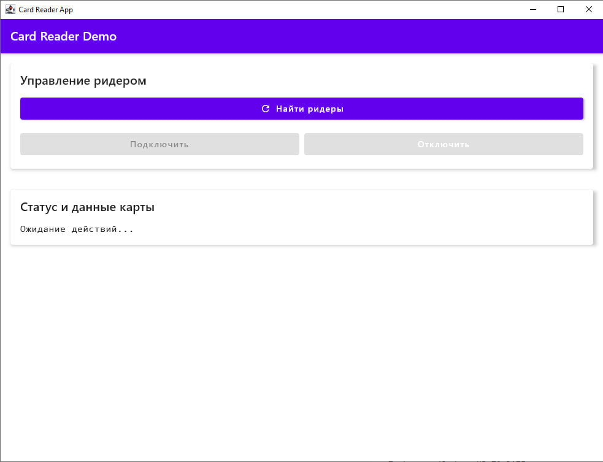
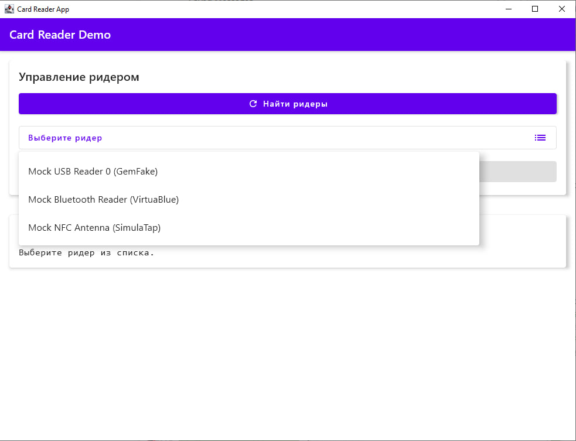
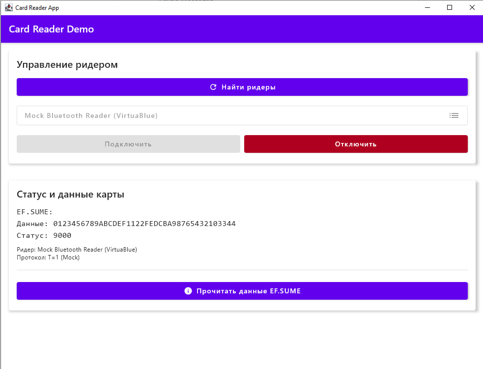

# CardReaderApp

## Описание
CardReaderApp — это десктопное приложение на Kotlin с использованием Jetpack Compose Desktop для взаимодействия с ридерами смарт-карт (SIM-карт) через PC/SC-интерфейс. Приложение позволяет искать подключённые ридеры, подключаться к ним, отправлять APDU-команды и читать данные с SIM-карт.

## Структура проекта

```
CardReaderApp/
├── build.gradle.kts                # Скрипт сборки Gradle
├── settings.gradle.kts              # Настройки Gradle
├── gradle/                          # Служебные файлы Gradle Wrapper
├── src/
│   ├── main/
│   │   ├── kotlin/
│   │   │   └── com/sexysalve/cardreaderapp/
│   │   │       ├── Main.kt         # Главный UI и логика приложения (Kotlin)
│   │   ├── java/
│   │   │   └── com/sexysalve/cardreaderapp/
│   │   │       └── CardReaderBackend.java # Логика работы с ридером и APDU (Java, рекомендуется для совместимости)
│   │   └── resources/              # Ресурсы приложения
│   └── test/                       # Тесты (если есть)
├── build/                          # Каталог сборки (генерируется автоматически)
└── ...
```

## Используемые технологии
- **Kotlin**: основной язык разработки (UI и логика)
- **Java**: рекомендуется для низкоуровневой работы с ридером (CardReaderBackend)
- **Jetpack Compose Desktop**: UI-фреймворк для создания кроссплатформенных десктопных приложений
- **PC/SC**: стандарт взаимодействия с ридерами смарт-карт
- **apdu4j**: Java-библиотека для работы с кард-ридерами и APDU-командами ([apdu4j на GitHub](https://github.com/martinpaljak/apdu4j?tab=readme-ov-file#get-it-now))
- **Gradle**: система сборки

## Инструкция по сборке и запуску
1. Установите JDK 17 или новее.
2. Клонируйте репозиторий:
   ```sh
   git clone <адрес-репозитория>
   cd CardReaderApp
   ```
3. Соберите проект:
   ```sh
   ./gradlew build
   ```
4. Запустите приложение:
   ```sh
   ./gradlew run
   ```

## Стандарты и структура файловой системы SIM/USIM-карт
SIM/USIM-карты реализуют файловую систему, определённую стандартами ETSI/3GPP:
- [TS 131 102](https://www.etsi.org/deliver/etsi_ts/131100_131199/131102/08.21.00_60/ts_131102v082100p.pdf) — структура и расположение файлов на USIM-карте
- [TS 102 222](https://www.etsi.org/deliver/etsi_ts/102200_102299/102222/08.00.00_60/ts_102222v080000p.pdf) — формат содержимого EF.SUME

Основные элементы:
- **MF (Master File)**: корневой каталог
- **DF (Dedicated File)**: подкаталоги (например, DF.GSM, DF.TELECOM, DF.UMTS)
- **EF (Elementary File)**: файлы с данными (например, EF.IMSI, EF.SMS, EF.SUME)

Для чтения EF.SUME:
- Путь: MF/DF.TELECOM/EF.SUME
- Последовательность команд: выбор DF.TELECOM, затем EF.SUME, затем чтение данных

Доступ к файлам осуществляется с помощью APDU-команд (Application Protocol Data Unit), которые отправляются на карту через ридер. Пример последовательности: выбор ADF/DF, затем выбор EF, затем чтение данных.

## Пример работы с файловой системой SIM-карты
1. Выбор приложения (ADF/DF):
   - APDU: `00 A4 04 00 ...`
2. Выбор файла (EF):
   - APDU: `00 A4 02 0C ...`
3. Чтение бинарных данных:
   - APDU: `00 B0 00 00 ...`

# Интерфейс приложения (скриншоты)

|             Поиск ридеров              |        Подключение карты               |             Чтение EF.SUME             |
|:--------------------------------------:|:--------------------------------------:|:--------------------------------------:|
|  |  |  |

---

# CardReaderApp — описание backend-компонентов

## Основные классы и функции backend (Java)

### CardReaderBackend
Главный класс для взаимодействия с кард-ридером и смарт-картой. Предоставляет методы:
- **listTerminalNames()** — возвращает список доступных кард-ридеров.
- **connectToTerminalByName(String terminalName)** — подключается к выбранному ридеру и карте.
- **disconnectCard()** — отключает карту/ридер.
- **isCardConnected()** — проверяет, подключена ли карта.
- **getConnectedCardProtocol()** — возвращает протокол подключения (например, T=0/T=1).
- **getConnectedTerminalName()** — возвращает имя текущего ридера.
- **sendApdu(byte[] commandBytes)** — отправляет APDU-команду на карту, возвращает ответ.
- **readEfSume()** — выполняет последовательность команд для выбора DF.TELECOM, EF.SUME и чтения содержимого EF.SUME.

### MockCard и MockCardChannel
Заглушки для тестирования без реального оборудования:
- **MockCard** — эмулирует смарт-карту, поддерживает выбор DF.TELECOM, EF.SUME и чтение данных EF.SUME.
- **MockCardChannel** — эмулирует канал передачи APDU-команд.

### Особенности реализации
- Используется библиотека **apdu4j** для работы с реальными кард-ридерами через PC/SC.
- В режиме MOCK_MODE (для тестов) все операции эмулируются без физической карты.
- Вся логика работы с картой и ридером инкапсулирована в CardReaderBackend, UI взаимодействует только с ним.
- Обработка ошибок (например, отсутствие службы Smart Card) реализована с выводом понятных сообщений.

---

## Переключение между MOCK_MODE и реальным режимом

По умолчанию приложение запускается в режиме эмуляции (MOCK_MODE), который позволяет тестировать интерфейс и логику без физического кард-ридера и карты. 

**Чтобы включить работу с реальным оборудованием:**
1. Откройте файл `src/main/java/com/sexysalve/cardreaderapp/CardReaderBackend.java`.
2. Найдите строку (атрибут класса CardReaderBackend):
   ```java
   private final boolean MOCK_MODE = true;
   ```
3. Измените её на:
   ```java
   private final boolean MOCK_MODE = false;
   ```
4. Пересоберите и перезапустите приложение.

В реальном режиме потребуется подключённый кард-ридер и установленная/запущенная служба "Smart Card" (SCardSvr) в Windows.
